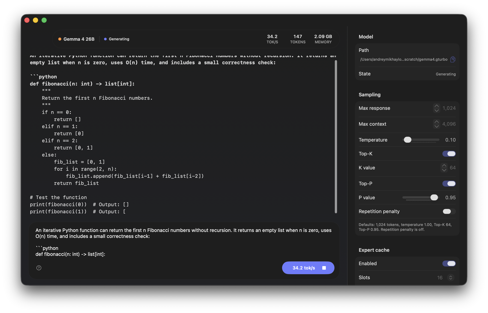

<p align="center">
  
</p>

<h1 align="center">TurboFieldfare</h1>

<p align="center">
  <strong>Gemma 4 26B-A4B inference in about 2 GB of RAM</strong><br>
  A custom Swift + Metal runtime for Apple Silicon Macs, even the 8 GB ones.
</p>

<p align="center">
  
  
  
  <a href="LICENSE"></a>
</p>

<p align="center">
  <a href="#try-it">Quick start</a> ·
  <a href="docs/BENCHMARKS.md">Benchmarks</a> ·
  <a href="docs/COMMUNITY_BENCHMARKS.md">Contribute results</a> ·
  <a href="docs/SYSTEM_DESIGN.md">How it works</a> ·
  <a href="docs/OPTIMIZATION_JOURNEY.md">Experiments</a> ·
  <a href="docs/IMPLEMENTATION_REFERENCES.md">References</a>
</p>



Memory got expensive. So I gave a 26-billion-parameter model a ~2 GB budget.

TurboFieldfare runs **[Gemma 4 26B-A4B](https://ai.google.dev/gemma/docs/core/model_card_4)** on Apple Silicon by keeping the common
weights, working buffers, and a 4K-context KV cache in unified memory. The
routed-expert pool stays on SSD and is read on demand.

Even at 4 bits, the text-only model occupies about 14.5 GB. Keeping the complete
checkpoint resident on the target 8 GB M2 MacBook Air would exceed physical
memory before allocating the KV cache.

Gemma's mixture-of-experts layers create an opening: each layer has 128 routed
experts, but each token uses only 8. TurboFieldfare keeps the 1.58 GB common
core in unified memory and reads only the experts selected for the current
layer.

The runtime, streaming installer, CLI, and native Mac app are written in Swift
and Metal. TurboFieldfare is model-specific rather than a wrapper around MLX or
llama.cpp. The curated [experiment record](docs/experiments/EXPERIMENT_INVENTORY.md)
summarizes 102 measured results across kernels, caching, I/O, prefill, and
decode.

## Try it

```bash
git clone https://github.com/drumih/turbo-fieldfare.git
cd turbo-fieldfare
swift build -c release
.build/release/TurboFieldfareMac
```

On the first run, Swift Package Manager downloads and builds the Swift packages
required by the tokenizer. The complete release build includes the foreground
Mac app and its sibling decode-service executable.

When the app opens, choose **Install** and let TurboFieldfare fetch and repack
the pinned model (about 15 GB). Once it is ready, choose **Load Model**, type
your prompt, and press **Generate**.

## At a glance

| Metric          | Value                                                                                                                    |
| --------------- | ------------------------------------------------------------------------------------------------------------------------ |
| Model           | Gemma 4 26B-A4B, 26B total parameters, ~3.88B active per token                                                           |
| Weights         | MLX affine 4-bit, group 64, with 8-bit router and shared-expert overrides                                                |
| Memory          | ~1.9 GB common model, KV, and scratch allocation at 4K; expert-slot and file-cache residency varies with use             |
| Storage         | ~14.5 GB text-only `.gturbo` model installation                                                                          |
| Hardware        | Apple Silicon Mac; validated on an 8 GB M2 MacBook Air                                                                    |
| Platform        | macOS 26, Metal 4, Swift 6.2                                                                                             |
| M2 measured decode | [5.1-6.3 tok/s](docs/BENCHMARKS.md#m2-measured-decode) on an 8 GB M2 MacBook Air |
| M5 measured decode | [32.0-36.1 tok/s](docs/BENCHMARKS.md#m5-measured-decode) on a 24 GB M5 Pro |

The measured result is a reference point, not a performance ceiling. Prompt
length, generated length, page-cache state, and hardware all affect throughput.
To help measure another Apple Silicon Mac, follow the
[community benchmark guide](docs/COMMUNITY_BENCHMARKS.md).

## Using TurboFieldfare

TurboFieldfare provides a native Mac app and a command-line interface. Both
use the same `.gturbo` model directory. Start with the Mac app; use the CLI for
scripts, reproducible runs, and direct control over generation settings.

The Swift package exposes five products:

| Product | Purpose |
| --- | --- |
| `TurboFieldfare` | Swift library containing the runtime and Metal kernels |
| `TurboFieldfareMac` | Native Mac app for installation and generation |
| `TurboFieldfareDecodeService` | One-shot local model and Metal owner used by the Mac app |
| `TurboFieldfareCLI` | Command-line text completion |
| `TurboFieldfareRepack` | Streaming model installer and install verifier |

### Requirements

- An Apple Silicon Mac; the validated target is an 8 GB M2 MacBook Air
- macOS 26 with Metal 4
- Xcode 26 and Swift 6.2 or newer
- Enough free storage for the ~14.5 GB model installation
- An internet connection for the first model install

The package is arm64-only. Older macOS and Metal versions are not supported.

### Prompting the model

> [!IMPORTANT]
> TurboFieldfare performs **text completion**, not instruction following.
> The Mac app and CLI pass prompts directly to the base model without an
> instruction or chat template. Write text you want continued, such as `The
> capital of France is` or `Q: Why is the sky blue?\nA:`.

The interactive default generates up to 1,024 new tokens with temperature
`1.0`, Top-K `64`, and Top-P `0.95`. The repetition penalty is off (`1.0`).
Temperature `0` selects deterministic greedy decoding. The model may still
repeat, loop, or produce incorrect text, so review its continuation.

For help writing effective prompts, see Google’s [Gemma prompt guide](https://ai.google.dev/gemma/docs/capabilities/text/basic).
TurboFieldfare handles model tokenization, so enter only the prompt text rather than Gemma’s control tokens.

### Mac app

Clone the repository, then run the app from its root:

```bash
swift build -c release
.build/release/TurboFieldfareMac
```

Build the complete package so the app and its sibling decode service are both
available. When launched from this checkout, the app stores the model in
`scratch/gemma4.gturbo`.

#### Install the model

On first launch, the app checks the available storage and shows the download
and installed sizes. Choose **Install** to begin.

The installer never materializes the full source checkpoint. It streams the
required byte ranges from the pinned Hugging Face revision and repacks them
directly into the `.gturbo` layout as they arrive. This avoids a second full
checkpoint on disk and keeps scratch memory bounded.

The first installation transfers about 15 GB through bounded Hugging Face
range requests. Network speed and Hugging Face response times vary, so it can
take a while. The completed `.gturbo` installation occupies about 14.5 GB and
is accepted only after its manifest and file hashes have been validated.
Installation does not load the model into memory.

#### Load and generate

After installation:

1. Choose **Load Model**.
2. Enter a prompt in the composer.
3. Choose **Generate**, or press <kbd>Command</kbd>+<kbd>Return</kbd>.
4. Use the stop button or <kbd>Escape</kbd> to end generation early.

The status bar reports the current phase, generated tokens, decode rate, and
decode-service memory use. The fixed right settings pane controls sampling,
context length, the expert cache, and runtime options. Settings that affect the
loaded runtime require a reload before the next generation. During chunked
prefill, the app reports exact progress such as `Prefill (128/514)`. See
[Runtime controls](docs/RUNTIME_CONTROLS.md) for the allowed values, defaults,
and result metrics.

### Command-line interface

The CLI uses an existing `.gturbo` installation. If you installed the model
through the Mac app, it is already available at `scratch/gemma4.gturbo`.
Otherwise, install it from the command line:

```bash
swift run -c release TurboFieldfareRepack \
  --output scratch/gemma4.gturbo \
  --overwrite
```

The runtime accepts only a completed `.gturbo` directory with a final
`manifest.json`.

Verify an existing installation without loading the model:

```bash
swift run -c release TurboFieldfareRepack \
  --verify-install \
  --input-gturbo scratch/gemma4.gturbo
```

#### Raw completion

`--prompt` passes text directly to the model without applying a chat template:

```bash
swift run -c release TurboFieldfareCLI \
  --model scratch/gemma4.gturbo \
  --prompt "The capital of France is" \
  --max-new 64 \
  --temperature 0
```

This example deliberately requests a short greedy completion. Omitting its
generation overrides uses the same interactive defaults as the Mac app.

Common generation options include `--max-context`, `--temperature`, `--top-k`,
`--top-p`, `--repetition-penalty`, `--seed`, and repeatable `--stop` strings.
The public CLI uses production runtime defaults. Run the following command for
the complete option list:

```bash
swift run -c release TurboFieldfareCLI --help
```

Generated text goes to standard output. Timing statistics go to standard error;
add `--quiet` to suppress that footer in scripts.

## Test and contribute

Run the public test suite serially:

```bash
Scripts/test.sh
```

Before starting a model run, close memory-heavy apps and check
`memory_pressure -Q`. If it reports little free memory, postpone the run. Run
only one TurboFieldfare or local-model process at a time.

To contribute a comparable performance result, follow the
[community benchmark guide](docs/COMMUNITY_BENCHMARKS.md).

## How the inference engine works

At each transformer layer, Metal computes attention and the router from
resident weights. The CPU uses the router's top-8 expert IDs to plan against
the layer's 16-slot LFU cache, then fills misses with bounded parallel `pread`
calls into Metal-visible buffers. Metal computes the resident shared-expert
branch while those reads run, then combines the shared and routed outputs.

Prompt prefill uses chunks of up to 128 tokens so one fetched expert can serve
multiple rows. Generation repeats the routed layer loop one token at a time.
The installer applies the same bounded-memory rule: it repacks remote ranges
directly into `.gturbo` without staging a full shard or tensor.

For a visual introduction to the model architecture, see Maarten Grootendorst's
[A Visual Guide to Gemma 4](https://newsletter.maartengrootendorst.com/p/a-visual-guide-to-gemma-4).

[System design](docs/SYSTEM_DESIGN.md) explains the `.gturbo` layout, memory
ownership, prefill, router handoff, `cb1`/`io`/`cb2` phases, Metal kernels, and
correctness invariants.

## Status and scope

TurboFieldfare currently includes:

- Remote streaming repack into the `.gturbo` model format
- 4-bit MLX affine weights with 8-bit router and shared-expert overrides
- Custom Metal kernels for quantized GEMV, attention, MoE, normalization,
  RoPE, sampling, and production fusions
- SSD-backed routed-expert streaming with a bounded expert cache
- Chunked single-prompt prefill and token-by-token generation with a production
  FP16 KV ring through 4K
- A Swift library, streaming installer, command-line interface, and native
  SwiftUI/AppKit Mac app with a one-shot local decode service

Current scope is text-only inference from the pinned Gemma 4 26B-A4B
checkpoint on Apple Silicon Macs. The 8 GB M2 MacBook Air is the deployment
and compatibility reference; the 24 GB M5 Pro is the current performance host.

The Mac app exposes the experimental packed K4/V4 KV path as an explicit
control. It is not the default because it failed the full quality gate.

### Future work

- Build iPhone and iPad apps, then measure inference speed and memory use on
  mobile hardware.
- Benchmark more Apple Silicon Macs, especially the base 16 GB M4 Mac mini and
  other 8 GB models.

## Experiments and technical documentation

The [experiments that shaped TurboFieldfare](docs/OPTIMIZATION_JOURNEY.md)
explain the largest wins, the plausible ideas that failed, and the early
results that reversed under stronger validation. The detailed
[experiment record](docs/experiments/EXPERIMENT_INVENTORY.md) keeps all 102 audited entries
as optional evidence; neither document requires the private benchmark archive.

Useful entry points:

- [System design](docs/SYSTEM_DESIGN.md)
- [Benchmarks](docs/BENCHMARKS.md)
- [The experiments that shaped TurboFieldfare](docs/OPTIMIZATION_JOURNEY.md)
- [Experiment inventory and summaries](docs/experiments/EXPERIMENT_INVENTORY.md)
- [Implementation references](docs/IMPLEMENTATION_REFERENCES.md)

## License and model terms

TurboFieldfare's source and documentation are licensed under the
[Apache License 2.0](LICENSE).

Model weights are not included. The installer downloads them separately from
the pinned Hugging Face checkpoint, and the weights remain governed by their
source terms. See [THIRD_PARTY_NOTICES.md](THIRD_PARTY_NOTICES.md) for the model
and Swift package license review.

TurboFieldfare is an independent research project. It is not affiliated with,
sponsored by, or endorsed by Google.

## Afterword and the project name

Thanks for checking out this project!

My name is Andrey Mikhaylov. You can find me on
[LinkedIn](https://www.linkedin.com/in/andrey-mikhaylov-ios-dev/).
I am the author of TurboFieldfare and an iOS and Metal engineer. Most of my
work is with images, video, and on-device AI.

I dedicate this project to my wife, Sasha, the most supportive person I know.
She stands by me even through the hardest times. She loves wildlife, goes
birdwatching, and volunteers with our local birding community. Because of her,
I have also grown closer to birds and nature.

TurboFieldfare is named after the fieldfare, a member of the thrush family and
my favourite bird. It is not the most noticeable or brightly coloured bird, but
it definitely has a character and unique features of its own. I think the same
is true of this project: it may not be the most practical, but I built it with
my favourite tools, especially Metal, in my favourite field, on-device ML
inference. It definitely has its own character and unique features.

Next time you are outside, touch the grass and listen to the birds. Sometimes
it is the most beautiful thing you can do. And if you can, support your local
wildlife community. They do important work.

Thank you!
