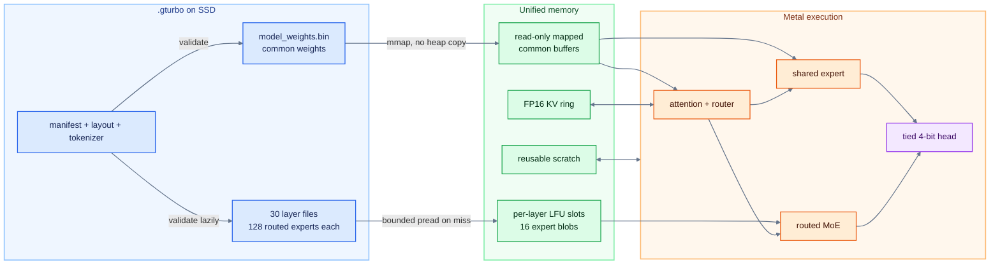
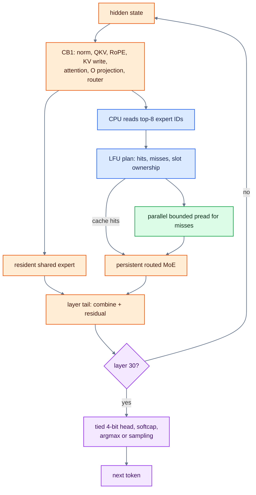

# System design

TurboFieldfare is a Swift and Metal runtime for Gemma 4 26B-A4B on Apple
Silicon. The text-only installation is about 14.3 GB, but the target machine
has 8 GB of memory. The runtime keeps the common weights and working state
available to Metal. It stores routed experts in per-layer files and reads only
the experts chosen for the current token or prefill chunk.

This document covers the current `production` path. The [optimization
journey](OPTIMIZATION_JOURNEY.md) covers the experiments, including the
failures and changes we later reversed.

Prefill and decode are the two execution modes used below. Prefill processes
known prompt tokens in bounded chunks; decode generates one new token at a
time. Both use the same mapped common weights, FP16 KV cache, and per-layer
streamed-expert cache.

## Why the runtime has this shape

Only a few properties of Gemma 4 determine most of the system design:

- The model has 30 transformer layers: 25 sliding-window-attention layers and
  5 full-attention layers.
- Every layer has 128 routed experts. The router selects 8 for each token.
- A dense shared expert forms a separate branch alongside the routed experts.
  Its output is added without a routing weight.
- The embedding and language-model head share the same quantized weights.
- The pinned instruction checkpoint uses MLX affine quantization: packed 4-bit
  values with a BF16 scale and BF16 bias for each group of 64 weights. Router
  projections use 8-bit weights; shared and routed experts use 4-bit weights.

For a visual introduction to Gemma 4's hybrid attention and MoE structure, see
[A Visual Guide to Gemma 4](https://newsletter.maartengrootendorst.com/p/a-visual-guide-to-gemma-4).

The production FP16 KV cache uses two layouts. The 25 sliding-window layers
attend to the latest 1,024 tokens and store K/V in 1,152-row rings. The extra
128 physical rows allow chunked-prefill writes. The 5 full-attention layers use
append-only storage and keep the complete context.

In a full-attention layer, the raw K projection supplies both the raw K and V
values. The paths then split. K receives scaled per-head normalization and
RoPE. V receives a separate no-scale normalization and no RoPE, so the cache
stores K and V separately.

The runtime must also match these Gemma-specific details: NeoX RoPE, attention
scale `1.0`, no router-logit softcap, parallel shared and routed FFNs, a learned
layer scalar, and a final logit softcap of `30.0`.

## Source weights and bounded repack

The installer reads
[`mlx-community/gemma-4-26b-a4b-it-4bit`](https://huggingface.co/mlx-community/gemma-4-26b-a4b-it-4bit)
at revision `0d77464eeb233a2da68ebf9d7dc4edaac7db956d`. The accepted source index has
SHA-256 `bf198c9f5ea6462addca1966e5dd669c407537a876e82cf06db9084c5c850b13`.
The installer does not download a complete Hugging Face snapshot or
write a complete safetensors shard to disk.

Instead, the repacker:

1. reads the source index and tensor metadata;
2. requests bounded remote byte ranges;
3. copies packed values, scales, and biases through tile-sized scratch;
4. writes resident tensors and routed experts directly into their final
   locations;
5. omits the vision tensors; and
6. writes `manifest.json` after every file listed in it is complete and hashed,
   then writes `verified-install.json`.

The repacker changes the layout but copies the quantized values unchanged. It
never dequantizes and requantizes them. In the validated install, the largest
payload and scratch heap were 524,288 bytes each. The full 15 GB-class source
never exists in a Swift heap buffer.

See the [command-line instructions](../README.md#command-line-interface) for
installation. The [optimization journey](OPTIMIZATION_JOURNEY.md#explicit-reads-made-expert-streaming-work)
records the current instruction-checkpoint validation.

## The `.gturbo` directory

The installation tree is abridged below:

```text
gemma4.gturbo/
  manifest.json
  verified-install.json
  model_weights.bin
  tokenizer/
    config.json
    tokenizer.json
    tokenizer_config.json
    special_tokens_map.json        # optional
    chat_template.jinja             # optional source sidecar
    chat_template.json              # optional source sidecar
  packed_experts/
    layout.json
    layer_00.bin
    ...
    layer_29.bin
```

`model_weights.bin` contains the embedding/head, attention projections,
routers, shared experts, norms, and scalar parameters. Each `layer_XX.bin`
contains 128 fixed-stride routed-expert blobs for one layer. `layout.json`
describes the packed subregions within each blob.

The expert stride is page aligned, and each sub-tensor has its own offset.
Metal kernels bind subregions of an existing buffer instead of creating one
buffer per tensor.

The current production manifest describes the model's group-64 affine
quantization: 4-bit embedding and attention weights, an 8-bit router, and
4-bit shared and routed experts. Missing or incompatible quantization metadata
is rejected.

`manifest.json` marks the installation as complete and defines what the runtime
may load. It records the architecture, file sizes, and SHA-256 hashes. Without
it, the runtime treats the installation as partial. `verified-install.json`
records which manifest, directory, and files were verified.

By default, TurboFieldfare hashes `manifest.json`, `model_weights.bin`, and
`packed_experts/layout.json` at load, then hashes each routed-expert layer file
on first use. The trusted-receipt policy is an explicit alternative. It still
hashes the same three common files. For large layer files, it checks the
receipt binding, manifest metadata, layout, and current file size instead of
hashing the complete file again.

In both modes, the runtime rejects unknown format flags, incompatible
architecture values, missing layer files, invalid alignment, and failed
integrity checks.

## Resource split

These tables separate three different numbers: file size, virtual allocation,
and physical memory in use. The common-model file is about 1.35 GB in decimal
units. Filled slot pages also use physical memory, and macOS may retain another
copy of recently read expert data in its file cache.

Resident and reusable app-owned resources:

| Resource | Current size or capacity | Ownership and behavior |
| --- | ---: | --- |
| Common model file | 1,353,771,068 bytes | Read-only file mapping wrapped by Metal buffers. |
| FP16 KV cache at 4K | About 305 MiB | App-owned. The 25 sliding-window layers use bounded 1,152-row rings; the 5 full-attention layers use linear storage sized for the requested context. |
| Reusable runtime scratch | About 15.6 MiB for the production 128-token prefill arena, plus about 2 MiB of split-attention scratch and smaller decode buffers | App-owned and reused across layers or chunks. |

Streamed expert resources:

| Resource | Current size or capacity | Ownership and behavior |
| --- | ---: | --- |
| Routed-expert slots | 16 per opened layer; one page-rounded 3,358,720-byte blob per slot | App-owned buffers allocated with 2 MiB alignment and wrapped by Metal without another copy. Opening all 30 layer streamers reserves about 1.50 GiB of slot capacity; pages become resident as reads fill them. |
| Routed-expert files | 12,897,484,800 bytes (12.01 GiB) on disk | Thirty per-layer files. Only selected blobs enter explicit slots; the files are not mapped as one resident pool. |
| macOS unified file cache | Dynamic | OS-owned second-chance cache. It may make a `pread` cheap, but it is not a guaranteed part of the app budget. |

Each opened layer has 16 expert slots, but untouched slot pages are not
necessarily resident. RSS and physical footprint depend on the layers and
experts used, file-cache state, and memory pressure. Static capacity therefore
does not predict process RSS.

## Load and ownership

The loader maps `model_weights.bin` read-only and wraps its aligned regions in
`MTLBuffer` objects without copying them into Swift collections.

Routed-expert files open lazily. Each opened layer owns one file descriptor and
a fixed group of slot buffers with 2 MiB alignment. Each slot is allocated
once, registered with Metal through `makeBuffer(bytesNoCopy:)`, filled with
`pread`, and reused until the layer streamer is released.

The expert cache records which expert occupies each slot. Production uses
least-frequently used (LFU) eviction with recency as the tie-breaker. A hit
reuses the existing buffer. A miss assigns an evictable slot and starts a
bounded read. Distinct misses can run in parallel, but no two reads may write
the same slot concurrently.



## Instruction framing

The Mac app and CLI `--messages-file` mode use the pinned text-only Gemma 4 chat
format. The app wraps one user prompt. `--messages-file` accepts user and
assistant messages plus an optional leading system message. Assistant messages
render with Gemma's `model` role.

The runtime stops generation on `<eos>` (token 1), `<turn|>` (token 106), or
`<|tool_response>` (token 50). The third token is a defensive boundary; tool
calling itself is not supported. CLI `--prompt` bypasses chat framing for raw
completion and reproducible comparisons.

## Prefill

The production profile handles up to 128 prompt tokens at a time. Execution
stays layer-major: it moves each bounded group of rows through the transformer
one layer at a time, without holding expert activations for the full prompt.

For each chunk and layer, TurboFieldfare:

- runs projection GEMM/QMM paths where the row count can amortize setup;
- applies causal sliding-window or full attention and writes K/V rows;
- computes router outputs for all rows in the chunk;
- groups token/expert pairs into bounded routed-MoE work;
- streams experts in tiles of at most eight;
- may fetch the next tile while GPU work for the current tile remains queued,
  with both tiles fitting in the 16-slot cache;
- never reuses a slot while queued GPU work still owns it; and
- combines the resident shared branch and routed branch before the layer tail.

Eligible 4-bit prefill projections use staged affine Metal Performance
Primitives (MPP). The runtime unpacks each tile of affine-quantized weights into
bounded FP16 staging, then passes it to MPP. Grouped routed MoE reuses its
argument and activation scratch. The language-model head runs only for the
final prompt row needed to start generation.

## Decode

Decode generates one token at a time. In each layer, the first Metal
command-buffer phase, `cb1`, produces the router's top-8 result. The CPU must
read those expert IDs before it knows which files to access, creating a CPU and
I/O handoff before `cb2`.

The resident router normalizes and scales the layer's post-attention hidden
state, then projects it to 128 expert scores:

```text
router_input = rmsnorm_no_scale(hidden)
scaled_input = router_input * router_scale / sqrt(hidden_size)
logits       = int8_affine(scaled_input)
top8         = highest_8(logits)
weights      = softmax(logits[top8]) * per_expert_scale[top8]
```

The GPU returns eight expert IDs and eight FP16 routing weights. The IDs drive
the cache-hit, eviction, and file-read plan.

The implementation labels this handoff as three phases:

| Phase | Work |
| --- | --- |
| `cb1` | Metal runs input norm, Q/K/V projections, RoPE and KV writes, attention, output projection, post-attention setup, and the router. It completes when the top-8 IDs are ready for CPU readback. |
| `io` | The CPU looks up the top-8 experts in the layer cache and fills only missing slots with `pread`. Metal starts the resident shared-expert branch after `cb1` so it overlaps these reads. Cached routed-expert work can also begin early. |
| `cb2` | Metal finishes the routed top-8 branch, reduces it with the router weights, combines it with the shared branch, and applies the post-FFN norms, residual, and layer scalar. |

Work overlaps across these phases. The command-buffer pipeline can delay
waiting for `cb2` while the CPU encodes and queues the next layer. The
diagnostic counters also use different clocks: `cb1` and `cb2` record CPU
encode-and-commit overhead, while `io` records awaited read time. They are not
three serial or directly comparable durations.



Routed work for cache hits may start while reads for missing experts are still
running. Work for a cache miss starts after its slot is filled. Queue order
makes the layer tail wait for both the shared and routed branches.

After layer 30, the tied 4-bit head has two output modes. A pure-greedy
configuration (temperature `0` and repetition penalty `1`) returns the argmax
token directly. Other configurations write the full logits vector for the
sampler.

Sampling applies Top-P to the full distribution, then Top-K, then temperature.
The default Top-K `64` path uses a specialized 1,024-to-64 reduction.
A pure-greedy configuration bypasses the sampler through the fused head. In the
logits path, temperature `0` selects the argmax after any repetition penalty.

## Metal execution

TurboFieldfare compiles its Metal source at runtime. Decode uses custom affine
INT4 and INT8 GEMV kernels that consume the checkpoint's packed values, BF16
scales, and BF16 biases directly. MPP prefill dequantizes one bounded weight
tile into FP16 threadgroup memory and passes FP16 tensors to `matmul2d`. The
routed MoE kernels fuse affine decode, GeGLU, and the weighted expert reduction.
The relevant Apple API sources are listed under
[Apple Metal](IMPLEMENTATION_REFERENCES.md#apple-metal).

Packed-weight loads use the alignment guaranteed by each path. Resident INT4
GEMVs and routed gate/up projections build each 4-byte value from two `ushort`
loads because their offsets may be only 2-byte aligned. Routed down-projection
offsets are 4-byte aligned, so that path uses `uint` loads. Wider loads are
valid only when the address has matching alignment.

The runtime fuses operations where the dataflow is stable: the QKV projection
and epilogue, post-attention setup, shared-expert phase 1, the layer tail, and
the tied head. It keeps the rest of the transformer layer split across kernels.
MPP handles prefill projections with enough rows to benefit from matrix
operations. Single-token decode stays on custom GEMV kernels.

## Code map

These files are the main entry points for the design described above. Their
references lead to the supporting code and tests.

- **Model contract and runtime path.** [`ArchConfig`](../Sources/TurboFieldfare/Infrastructure/ModelIO/ModelTypes.swift)
  defines the fixed Gemma 4 shape; [`RuntimeConfiguration`](../Sources/TurboFieldfare/Runtime/Configuration/RuntimeConfiguration.swift)
  defines the production configuration.
- **Remote install and `.gturbo` layout.** Start with
  [`SupportedModelSource`](../Sources/TurboFieldfareRepack/Core/Remote/SupportedModelSource.swift),
  [`RemoteStreamingRepacker`](../Sources/TurboFieldfareRepack/Core/Remote/RemoteStreamingRepacker.swift),
  and [`RepackPlanner`](../Sources/TurboFieldfareRepack/Core/Planning/RepackPlanner.swift)
  for the pinned source, bounded range repack, and resident/per-layer file plan.
- **Integrity and model load.** [`ManifestReader`](../Sources/TurboFieldfare/Infrastructure/ModelIO/ManifestReader.swift),
  [`VerifiedInstallReceipt`](../Sources/TurboFieldfare/Infrastructure/ModelIO/VerifiedInstallReceipt.swift),
  and [`Model.load`](../Sources/TurboFieldfare/Runtime/Inference/Model.swift) cover
  validation, resident mapping, and lazy layer verification.
- **Resident and streamed weights.** [`ResidentBuffer`](../Sources/TurboFieldfare/Infrastructure/ModelIO/ResidentBuffer.swift),
  [`ModelExpertIO`](../Sources/TurboFieldfare/Runtime/Inference/ModelExpertIO.swift),
  and [`PreadExpertStreamer`](../Sources/TurboFieldfare/Infrastructure/Streaming/PreadExpertStreamer.swift)
  own common weights, expert-cache planning, slots, and parallel bounded reads.
- **KV cache and attention.** [`KVCacheManager`](../Sources/TurboFieldfare/Runtime/KVCache/KVCacheManager.swift)
  owns bounded circular SWA storage and linear full-attention storage.
  [`Attention`](../Sources/TurboFieldfare/Kernels/Attention/Attention.swift) and
  [`PrefillAttention`](../Sources/TurboFieldfare/Kernels/Attention/PrefillAttention.swift)
  consume distinct FP16 K/V ranges.
- **Prompt and decode orchestration.** [`runRawCompletion`](../Sources/TurboFieldfare/Runtime/Generation/RawCompletion.swift)
  owns the outer generation loop; [`RealForwardRunner`](../Sources/TurboFieldfare/Runtime/Inference/RealForwardRunner.swift)
  owns the per-layer prefill and decode graph.
- **Prefill memory and scheduling.** [`PrefillChunkScratch`](../Sources/TurboFieldfare/Runtime/Prefill/PrefillChunkScratch.swift),
  [`PrefillRoutedTileScheduler`](../Sources/TurboFieldfare/Kernels/Prefill/MoE/PrefillRoutedTileScheduler.swift),
  and [`MPPPrefillInt4QMM`](../Sources/TurboFieldfare/Kernels/TensorCore/MPPPrefillInt4QMM.swift)
  show bounded scratch, slot-safe expert tiles, and staged affine MPP projections.
- **Router and routed MoE.** [`MoE`](../Sources/TurboFieldfare/Kernels/MoE/MoE.swift)
  and [`moe.metal`](../Sources/TurboFieldfare/Metal/MoE/moe.metal) implement
  top-8 selection, cached-hit work, affine GeGLU, and weighted down reduction.
- **Metal library and fusions.** [`MetalContext`](../Sources/TurboFieldfare/Infrastructure/Metal/MetalContext.swift),
  [`tensorops.metal`](../Sources/TurboFieldfare/Metal/TensorCore/tensorops.metal),
  and [`fused.metal`](../Sources/TurboFieldfare/Metal/Fusions/fused.metal) show
  runtime compilation, the MPP tensor-ops kernel, and production decode fusions.

## Correctness and safety invariants

- The importer preserves source affine values. Lossless repack and load-width
  changes require exact byte or output identity.
- K and V remain distinct after their separate normalization and positional
  paths, even where the raw projection is shared.
- Every queued GPU consumer owns its slot and scratch bank until completion.
  CPU reuse cannot race an earlier command buffer.
- Kernels that reorder floating-point operations must remain deterministic
  within each tested path and stay within the reference tolerances. Exact
  output identity is not required across every path.
- No normal install, load, test, or benchmark may place a whole model, shard,
  expert, or source tensor in Swift heap memory.
- Only one real-model process runs at a time on the 8 GB validation host.
- Slow profiling modes are diagnostic evidence, not production throughput
  evidence.

## Scope and limitations

The current runtime supports text-only generation with the pinned Gemma 4
26B-A4B instruction checkpoint. The source model supports image input, but
TurboFieldfare omits its vision tower.

The Mac app offers 4K, 8K, 16K, 32K, and 64K context lengths. Current
acceptance evidence covers up to 4K; memory, correctness, and speed beyond 4K
have not been characterized. Vision input, training, fine-tuning, server
batching, and general model support are outside the current scope.

TurboFieldfare is a research system. The Mac app exposes a small set of typed
runtime controls. The production path uses FP16 KV, exact split-K/V
attention, a 16-slot LFU expert cache, chunked prefill, staged affine MPP
prefill, and batched routed MoE prefill. File-read advice (`RDADVISE`) is off by
default.

## Read next

- [Benchmarks](BENCHMARKS.md)
- [The experiments that shaped TurboFieldfare](OPTIMIZATION_JOURNEY.md)
- [Complete experiment inventory](experiments/EXPERIMENT_INVENTORY.md)
- [Implementation references](IMPLEMENTATION_REFERENCES.md)
