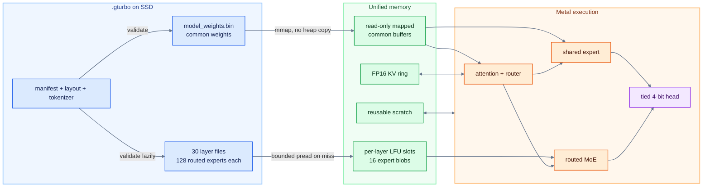
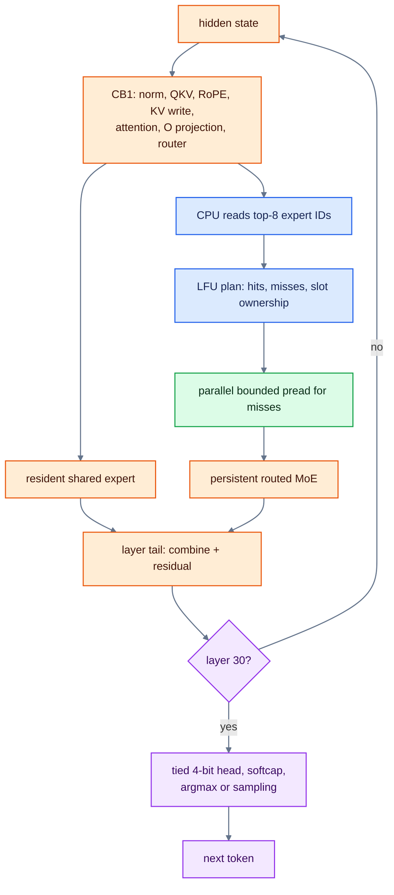

# System design

TurboFieldfare is a model-specific Swift and Metal runtime for text generation
with Gemma 4 26B-A4B on Apple Silicon. Its defining constraint is an 8 GB
machine running a text-only model installation of about 14.3 GB. The runtime
therefore cannot treat the checkpoint as one resident allocation. It keeps the
common language-model weights and working state available to Metal, stores the
routed experts in per-layer files, and reads only the experts selected for the
current work.

This document describes the current `production` path. The major wins,
failures, and reversals belong in [the experiments that shaped
TurboFieldfare](OPTIMIZATION_JOURNEY.md).

Prefill and decode are the two execution modes used below. Prefill processes
known prompt tokens in bounded chunks; decode generates one new token at a
time. Both use the same mapped common weights, FP16 KV cache, and per-layer
streamed-expert cache.

## Why the runtime has this shape

Only a few properties of Gemma 4 determine most of the system design:

- The model has 30 transformer layers: 25 sliding-window-attention layers and
  5 full-attention layers.
- Every layer has 128 routed experts. The router selects 8 for each token.
- A dense shared expert runs in parallel with the routed branch and is added
  without a routing weight.
- The embedding and language-model head share the same quantized weights.
- The pinned instruction checkpoint uses MLX affine quantization: packed 4-bit
  values with a BF16 scale and BF16 bias for each group of 64 weights. Router
  projections use 8-bit weights; shared and routed experts use 4-bit weights.

The production FP16 KV cache uses a mixed per-layer layout. The 25
sliding-window layers attend to the latest 1,024 tokens and store K/V in bounded
1,152-row rings, with 128 extra physical rows for chunked-prefill writes. The 5
full-attention layers use append-only linear storage and retain the complete
context. Full-attention layers reuse the raw K projection as the raw V source,
but the two paths immediately diverge: K receives scaled per-head normalization
and RoPE, while V receives a separate no-scale per-head normalization and no
RoPE. The cache therefore stores them separately.

The runtime also preserves Gemma-specific details that affect correctness:
NeoX RoPE, attention scale `1.0`, no router-logit softcap, parallel shared and
routed FFNs, a learned layer scalar, and a final logit softcap of `30.0`.

## Instruction framing

The Mac app and CLI `--messages-file` mode format user, model, and optional
leading system messages with the pinned text-only Gemma 4 chat format. The
runtime stops generation on `<eos>` (token 1), `<turn|>` (token 106), or
`<|tool_response>` (token 50). The third token is a defensive boundary; tool
calling itself is not supported. CLI `--prompt` bypasses this framing for raw
completion and reproducible comparisons.

## Source weights and bounded repack

The installer reads
[`mlx-community/gemma-4-26b-a4b-it-4bit`](https://huggingface.co/mlx-community/gemma-4-26b-a4b-it-4bit)
at revision `0d77464eeb233a2da68ebf9d7dc4edaac7db956d`. The accepted source index has
SHA-256 `bf198c9f5ea6462addca1966e5dd669c407537a876e82cf06db9084c5c850b13`.
The installer does not download a complete Hugging Face snapshot or
materialize a safetensors shard.

Instead, the repacker:

1. reads the source index and tensor metadata;
2. requests bounded remote byte ranges;
3. copies packed values, scales, and biases through tile-sized scratch;
4. writes resident tensors and routed experts directly into their final
   locations;
5. omits vision and audio tensors; and
6. writes `manifest.json` only after every output file is complete and hashed.

The repack changes layout, not quantized values. There is no dequantize and
requantize step. The largest payload and scratch heap in the validated install
were each 524,288 bytes; the full 15 GB-class source never exists in a Swift
heap buffer. See the [command-line instructions](../README.md#command-line-interface)
for installation and [IO-10](experiments/summaries/01-model-install-and-expert-io.md#io-10)
for the validation record.

## The `.gturbo` directory

The installation tree is abridged below:

```text
gemma4.gturbo/
  manifest.json
  verified-install.json
  model_weights.bin
  tokenizer/
    config.json
    tokenizer.json
    tokenizer_config.json
    special_tokens_map.json        # optional
    chat_template.jinja             # optional source sidecar
    chat_template.json              # optional source sidecar
  packed_experts/
    layout.json
    layer_00.bin
    ...
    layer_29.bin
```

`model_weights.bin` contains the embedding/head, attention projections,
routers, shared experts, norms, and scalar parameters. Each `layer_XX.bin`
contains 128 fixed-stride routed-expert blobs for one layer. `layout.json`
describes the packed subregions within each blob. The expert stride is page
aligned, and each sub-tensor carries its own offset; Metal kernels bind
subregions of an existing buffer rather than creating one buffer per tensor.

Production manifests must describe the model's group-64 affine quantization:
4-bit embedding and attention weights, an 8-bit router, 4-bit routed experts,
and a 4-bit or historical 8-bit shared expert. The instruction checkpoint uses
4-bit shared experts. A production manifest with missing or incompatible
quantization metadata is rejected.

The final manifest is both the install commit marker and the runtime contract.
It records architecture fields, file sizes, and SHA-256 hashes; a missing
manifest means a partial install. `verified-install.json` separately binds a
completed verification to that manifest, directory path, and file set.

Full SHA-256 verification remains the default. It verifies the common files at
load and each routed-expert layer file on first use. The explicit
trusted-receipt policy still hashes `manifest.json`, `model_weights.bin`, and
`packed_experts/layout.json`; for the large layer files, it validates the
receipt binding, manifest metadata, layout, and current size instead of reading
every file end to end again. On load, TurboFieldfare rejects unknown format
flags, incompatible architecture values, missing layer files, invalid
alignment, or a failed integrity check.

## Resource split

The tables distinguish file size, virtual allocation, and physical residency.
They are not interchangeable. The common-model file is about 1.35 GB in
decimal units. Slot pages also consume physical memory when filled, while
macOS may keep a separate, opportunistic file-cache copy of recently read
expert data.

Resident and reusable app-owned resources:

| Resource | Current size or capacity | Ownership and behavior |
| --- | ---: | --- |
| Common model file | 1,353,771,068 bytes | Read-only file mapping wrapped by Metal buffers. |
| FP16 KV cache at 4K | About 305 MiB | App-owned. The 25 sliding-window layers use bounded 1,152-row rings; the 5 full-attention layers use linear storage sized for the requested context. |
| Reusable runtime scratch | 15.8 MiB for the production 128-token prefill arena, plus about 2 MiB of split-attention scratch and smaller decode buffers | App-owned and reused across layers or chunks. |

Streamed expert resources:

| Resource | Current size or capacity | Ownership and behavior |
| --- | ---: | --- |
| Routed-expert slots | 16 per opened layer; one page-rounded 3,358,720-byte blob per slot | App-owned buffers allocated with 2 MiB alignment and wrapped by Metal without another copy. Opening all 30 layer streamers reserves about 1.50 GiB of slot capacity; pages become resident as reads fill them. |
| Routed-expert files | 12,897,484,800 bytes (12.01 GiB) on disk | Thirty per-layer files. Only selected blobs enter explicit slots; the files are not mapped as one resident pool. |
| macOS unified file cache | Dynamic | OS-owned second-chance cache. It may make a `pread` cheap, but it is not a guaranteed part of the app budget. |

The default 16-slot capacity is per layer, not a promise that every slot page
is resident immediately after load. Process RSS and physical footprint depend
on which layers and experts have been touched, file-cache state, and memory
pressure. For that reason, the table does not turn static byte counts into an
RSS claim.

The runtime stores KV data in FP16. Its 25 sliding-window layers use a fixed
1,152-row circular cache: 1,024 rows for the attention window and 128 extra
rows for chunked writes. Only the five full-attention layers grow with the
selected context length.

## Load and ownership

The loader maps `model_weights.bin` read-only and wraps its aligned regions in
`MTLBuffer` objects without copying their contents into Swift collections.
Routed-expert files open lazily. Each opened layer owns one file descriptor and
a fixed group of slot buffers allocated with 2 MiB alignment. A slot is
allocated once, registered with Metal through `makeBuffer(bytesNoCopy:)`, filled
with `pread`, and reused until the layer streamer is released.

The expert cache records which expert occupies each slot. The production
policy is LFU with recency as the tie-breaker. A hit reuses the existing
buffer. A miss assigns an evictable slot and issues a bounded read. Distinct
misses can run on the I/O executor in parallel, but no two reads may write the
same slot concurrently.



## Prefill

The production profile processes a prompt in chunks of at most 128 tokens.
The runner remains layer-major: it advances a bounded group of rows through
each transformer layer without materializing prompt-wide expert activations.

For each chunk and layer, TurboFieldfare:

- runs projection GEMM/QMM paths where the row count can amortize setup;
- applies causal sliding-window or full attention and writes K/V rows;
- computes router outputs for all rows in the chunk;
- groups token/expert pairs into bounded routed-MoE work;
- streams at most eight experts per routed tile; one tile may remain queued
  while the next is fetched, so both slot sets fit within the 16-slot cache
  without reusing live slots; and
- combines the resident shared branch and routed branch before the layer tail.

The staged affine MPP path is used for eligible 4-bit prefill projections. It
unpacks source-affine tiles into bounded FP16 staging and passes them to Metal
Performance Primitives. Grouped routed MoE reuses argument and activation
scratch. The language-model head runs only for the final prompt row needed to
begin generation.

## Decode

Generation advances one token at a time. Each layer has a CPU and I/O handoff
between the measured `cb1` and `cb2` phases because the CPU must read the
router's top-8 result before it knows which expert files to read. Shared-expert
and cached routed-expert work may use additional command buffers so they can
overlap that handoff.

The resident router normalizes and scales the layer's post-attention hidden
state, then projects it to 128 expert scores:

```text
router_input = rmsnorm_no_scale(hidden)
scaled_input = router_input * router_scale / sqrt(hidden_size)
logits       = int8_affine(scaled_input)
top8         = highest_8(logits)
weights      = softmax(logits[top8]) * per_expert_scale[top8]
```

The GPU writes eight expert IDs and eight FP16 routing weights. The CPU must
read those IDs before it can plan cache hits, evictions, and file reads. This
data-dependent handoff separates resident GPU work from streamed weights.

The last-run diagnostics divide the layer loop into three timing buckets:

| Bucket | Work |
| --- | --- |
| `cb1` | Metal runs input norm, Q/K/V projections, RoPE and KV writes, attention, output projection, post-attention setup, and the router. It completes when the top-8 IDs are ready for CPU readback. |
| `io` | The CPU looks up the top-8 experts in the layer cache and fills only missing slots with `pread`. Metal starts the resident shared-expert branch after `cb1` so it overlaps these reads. Cached routed-expert work can also begin early. |
| `cb2` | Metal finishes the routed top-8 branch, reduces it with the router weights, combines it with the shared branch, and applies the post-FFN norms, residual, and layer scalar. |

These buckets overlap; they are not three serial pauses. Shared-expert GPU work
overlaps `io`, and the command-buffer pipeline can defer the `cb2` wait while
the next layer begins.



The shared expert depends on the post-attention hidden state but not on routed
weights, so its GPU work overlaps expert reads. The routed kernel consumes the
selected slot buffers after the reads finish. Queue order ensures the layer
tail sees both branches. After layer 30, the tied 4-bit head either emits a
greedy token through the fused rows path or produces logits for sampling.
For sampled generation, the production path applies full-distribution Top-P,
then Top-K, then temperature. The default Top-K `64` path uses a specialized
1,024-to-64 reduction; temperature `0` bypasses sampling and selects greedy
output.

## Metal execution

TurboFieldfare compiles its Metal source at runtime. The decode path uses
custom affine INT4 and INT8 GEMV kernels that consume the checkpoint's packed
values, BF16 scales, and BF16 biases directly. The MPP prefill path instead
dequantizes one bounded weight tile into FP16 threadgroup memory and passes FP16
tensors to `matmul2d`. The relevant Apple API sources are collected under
[Apple Metal](IMPLEMENTATION_REFERENCES.md#apple-metal). The routed MoE kernels
fuse affine decode, GeGLU, and the weighted expert reduction.

Packed-weight load width follows the proven alignment of each live path.
Resident INT4 GEMVs and routed gate/up projections assemble each 4-byte chunk
from two `ushort` loads because their offsets are only guaranteed to be
2-byte aligned. The current routed down-projection layout satisfies 4-byte
alignment and uses `uint` loads. A wider load is incorrect when the live address
does not satisfy its alignment.

The runtime uses targeted fusions around stable dataflow boundaries: QKV
projection and epilogue, post-attention setup, shared-expert phase 1, the layer
tail, and the tied head. It does not try to make the whole transformer layer
one monolithic kernel. MPP is used where prefill supplies enough rows to suit
matrix operations; single-token decode remains a custom GEMV workload.

## Code map

These entry points lead from the design above into the implementation. Each
item names the owning types or hot-path files; follow their references for
helpers and tests.

- **Model contract and runtime path.** [`ArchConfig`](../Sources/TurboFieldfare/Infrastructure/ModelIO/ModelTypes.swift)
  defines the fixed Gemma 4 shape; [`RuntimeConfiguration`](../Sources/TurboFieldfare/Runtime/Configuration/RuntimeConfiguration.swift)
  defines the production configuration.
- **Remote install and `.gturbo` layout.** Start with
  [`SupportedModelSource`](../Sources/TurboFieldfareRepack/Core/Remote/SupportedModelSource.swift),
  [`RemoteStreamingRepacker`](../Sources/TurboFieldfareRepack/Core/Remote/RemoteStreamingRepacker.swift),
  and [`RepackPlanner`](../Sources/TurboFieldfareRepack/Core/Planning/RepackPlanner.swift)
  for the pinned source, bounded range repack, and resident/per-layer file plan.
- **Integrity and model load.** [`ManifestReader`](../Sources/TurboFieldfare/Infrastructure/ModelIO/ManifestReader.swift),
  [`VerifiedInstallReceipt`](../Sources/TurboFieldfare/Infrastructure/ModelIO/VerifiedInstallReceipt.swift),
  and [`Model.load`](../Sources/TurboFieldfare/Runtime/Inference/Model.swift) cover
  validation, resident mapping, and lazy layer verification.
- **Resident and streamed weights.** [`ResidentBuffer`](../Sources/TurboFieldfare/Infrastructure/ModelIO/ResidentBuffer.swift),
  [`ModelExpertIO`](../Sources/TurboFieldfare/Runtime/Inference/ModelExpertIO.swift),
  and [`PreadExpertStreamer`](../Sources/TurboFieldfare/Infrastructure/Streaming/PreadExpertStreamer.swift)
  own common weights, expert-cache planning, slots, and parallel bounded reads.
- **KV cache and attention.** [`KVCacheManager`](../Sources/TurboFieldfare/Runtime/KVCache/KVCacheManager.swift)
  owns bounded circular SWA storage and linear full-attention storage.
  [`Attention`](../Sources/TurboFieldfare/Kernels/Attention/Attention.swift) and
  [`PrefillAttention`](../Sources/TurboFieldfare/Kernels/Attention/PrefillAttention.swift)
  consume distinct FP16 K/V ranges.
- **Prompt and decode orchestration.** [`runRawCompletion`](../Sources/TurboFieldfare/Runtime/Generation/RawCompletion.swift)
  owns the outer generation loop; [`RealForwardRunner`](../Sources/TurboFieldfare/Runtime/Inference/RealForwardRunner.swift)
  owns the per-layer prefill and decode graph.
- **Prefill memory and scheduling.** [`PrefillChunkScratch`](../Sources/TurboFieldfare/Runtime/Prefill/PrefillChunkScratch.swift),
  [`PrefillRoutedTileScheduler`](../Sources/TurboFieldfare/Kernels/Prefill/MoE/PrefillRoutedTileScheduler.swift),
  and [`MPPPrefillInt4QMM`](../Sources/TurboFieldfare/Kernels/TensorCore/MPPPrefillInt4QMM.swift)
  show bounded scratch, slot-safe expert tiles, and staged affine MPP projections.
- **Router and routed MoE.** [`MoE`](../Sources/TurboFieldfare/Kernels/MoE/MoE.swift)
  and [`moe.metal`](../Sources/TurboFieldfare/Metal/MoE/moe.metal) implement
  top-8 selection, cached-hit work, affine GeGLU, and weighted down reduction.
- **Metal library and fusions.** [`MetalContext`](../Sources/TurboFieldfare/Infrastructure/Metal/MetalContext.swift),
  [`tensorops.metal`](../Sources/TurboFieldfare/Metal/TensorCore/tensorops.metal),
  and [`fused.metal`](../Sources/TurboFieldfare/Metal/Fusions/fused.metal) show
  runtime compilation, the MPP tensor-ops kernel, and production decode fusions.

## Correctness and safety invariants

- The importer preserves source affine values. Lossless repack and load-width
  changes require exact byte or output identity.
- K and V remain distinct after their separate normalization and positional
  paths, even where the raw projection is shared.
- Every queued GPU consumer owns its slot and scratch bank until completion.
  CPU reuse cannot race an earlier command buffer.
- Reordered floating-point kernels use deterministic within-arm checks plus
  reference-relative quality gates. Exact identity is not used as a universal
  quality metric.
- No normal install, load, test, or benchmark may place a whole model, shard,
  expert, or source tensor in Swift heap memory.
- Only one real-model process runs at a time on the 8 GB validation host.
- Slow profiling modes are diagnostic evidence, not production throughput
  evidence.

## Scope and limitations

The current runtime supports text-only generation with the pinned Gemma 4
26B-A4B instruction checkpoint. The Mac app offers 4K, 8K, 16K, 32K, and 64K
context lengths. Vision, audio, training, fine-tuning, server batching, and
general model support are outside the current scope.

TurboFieldfare is a research system. The Mac app exposes a small set of typed
runtime controls. The production path uses FP16 KV, exact split-K/V attention,
a 16-slot LFU expert cache, chunked prefill, staged affine MPP prefill, and
batched routed MoE prefill, with RDADVISE off.

## Read next

- [Benchmarks](BENCHMARKS.md)
- [The experiments that shaped TurboFieldfare](OPTIMIZATION_JOURNEY.md)
- [Complete experiment inventory](experiments/EXPERIMENT_INVENTORY.md)
- [Implementation references](IMPLEMENTATION_REFERENCES.md)
